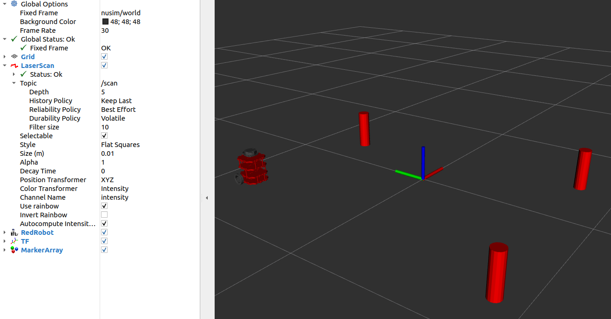

# NUSIM Package
Simulation and visualization environnment

# Launch File Description
* `ros2 launch nusim nusim.launch.xml` to see a robot and 3 obstacles in rviz.

# Parameters
 - x0: initial x position of robot
 - y0: initial y position of robot
 - theta0: initial orientation of robot
 - obstacles_x: list of x coordinates of obstacles
 - obstacles_y: list of y coordinates of obstacles
 - obstacles_r: radius of obstacles

Worked With nobody
