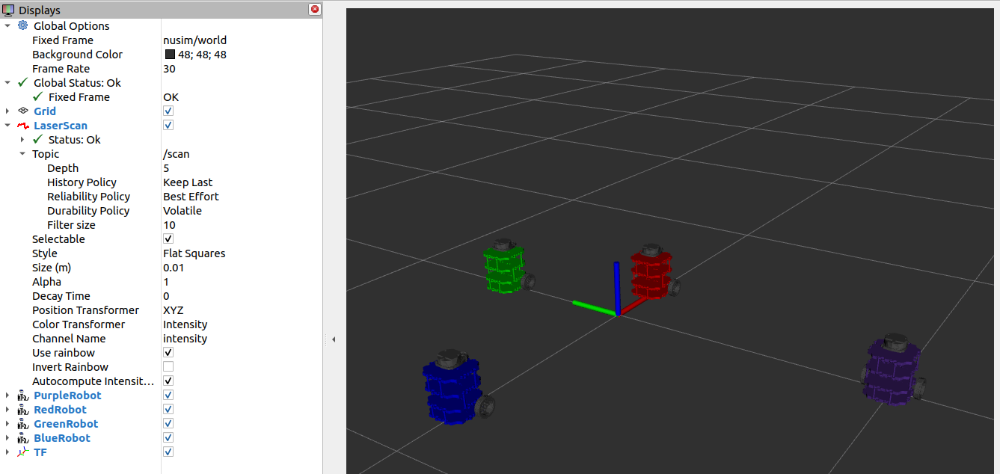

# Nuturtle  Description
URDF files for Nuturtle Terry
* `ros2 launch nuturtle_description load_one.launch.py` to see the robot in rviz.
* `ros2 launch nuturtle_description load_all.launch.xml` to see four copies of the robot in rviz.

* The rqt_graph when all four robots are visualized (Nodes Only, Hide Debug) is:

# Launch File Details
* `ros2 launch nuturtle_description load_one.launch.py --show-args`
  
  `Arguments (pass arguments as '<name>:=<value>'):
    'use_rviz':
        Launch rviz
        (default: 'true')
    'use_jsp':
        Launch joint_state_publisher
        (default: 'true')
    'color':
        Color of the turtlebot base. Valid choices are: ['purple', 'red', 'green', 'blue', '']
        (default: 'purple')`

* `ros2 launch nuturtle_description load_all.launch.xml --show-args`

  `Arguments (pass arguments as '<name>:=<value>'):
    'use_rviz':
        Launch rviz
        (default: 'true')
    'use_jsp':
        Launch joint_state_publisher
        (default: 'true')
    'color':
        Color of the turtlebot base. Valid choices are: ['purple', 'red', 'green', 'blue', '']
        (default: 'purple')`

Worked With nobody
